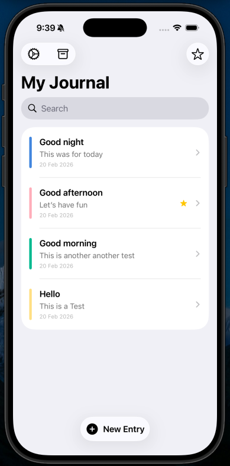
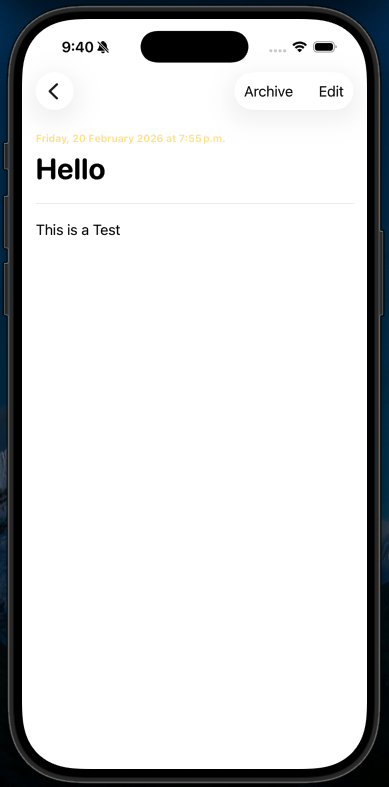
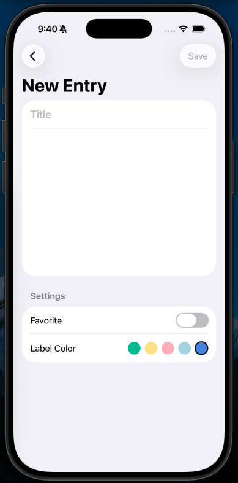
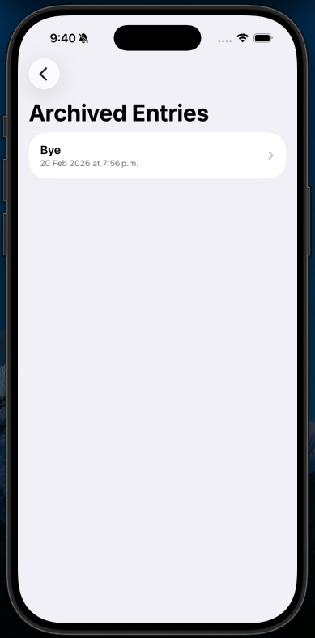
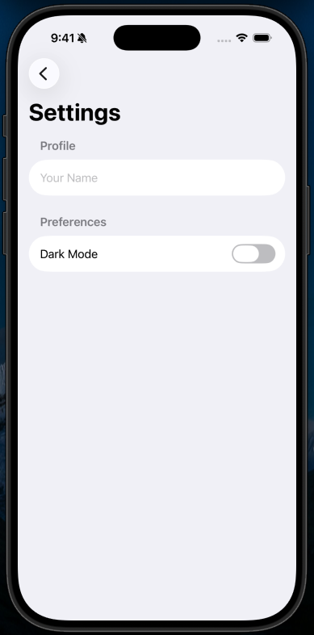
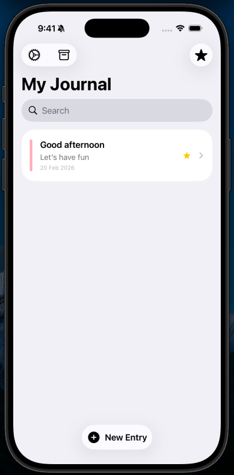

# Final Project — JournalApp
## Overview

JournalApp is a native iOS application designed for users who want a clean, private space to record their daily thoughts. It serves individuals looking to build a journaling habit without the distraction of overly complex interfaces. The app solves the problem of organizing personal records by offering customizable color labels, favoriting capabilities, and a dedicated archiving system to keep the main feed uncluttered. Main features include creating, editing, searching, and filtering text entries, alongside persistent user preference settings like dark mode.

## Features Checklist

- [x] SwiftUI UI with at least 3 screens (List + Create/Edit + Detail/History)
- [x] MVVM architecture (Adapted using SwiftData declarative queries and View-driven state)
- [ ] Proper permission handling (N/A for this specific text-based project)
- [x] Local persistence (SwiftData and AppStorage)
- [x] Clean navigation + readable UI

## Screenshots
Main: 

Entry View: 

Add Entry: 

Archive: 

Settings: 

Favorite: 

* **Main list screen:** ``
* **Create/Add screen:** ``
* **Detail/History screen:** ``
* **Archive & Settings:** ``

## Architecture

### Service Layer
Data persistence is handled natively via SwiftData (`@Model`) and `@AppStorage`. The SwiftData `modelContext` acts as the service layer, managing the insertion, deletion, and persistent saving of `JournalEntry` records directly to the local device database. 

### ViewModels
State management is handled using SwiftUI's declarative property wrappers (`@Query`, `@State`, `@Environment`). The `@Query` macro acts as the primary data binder, automatically fetching, sorting, and filtering data for the views, keeping the UI perfectly in sync with the persistent store without the need for boilerplate ViewModel classes.

### Views
* **List screen:** `EntryListView` (displays active entries, search bar, and favorites filter) and `ArchivedEntriesView` (displays hidden/archived records).
* **Create/Add screen:** `EntryFormView` (a dynamic form used for both creating new entries and editing existing ones).
* **Detail/History screen:** `EntryDetailView` (a read-only presentation of an entry's title, date, colored label, and full body text).
* **Settings screen:** `SettingsView` (manages global user preferences like name and dark mode).

## How to Run

1. Clone the repo
2. Open `JournalApp.xcodeproj` 
3. Select an iOS simulator or physical device in Xcode
4. Run (Cmd + R)

## Biggest Challenge + Solution

The biggest challenge I encountered was managing SwiftData schema changes during development. After adding the `isArchived` boolean property to the `JournalEntry` model to support the new archive feature, the app silently failed to save any new entries. This was difficult to debug because the app did not crash; the simulator simply refused to write to the database due to a schema mismatch between the old local storage and the updated code. I solved this by implementing default values for all model properties, enforcing explicit `try? context.save()` calls before view dismissal, and completely wiping the app from the simulator to force a fresh database generation. I learned how strict SwiftData is regarding schema modifications and the importance of properly handling database migrations.
